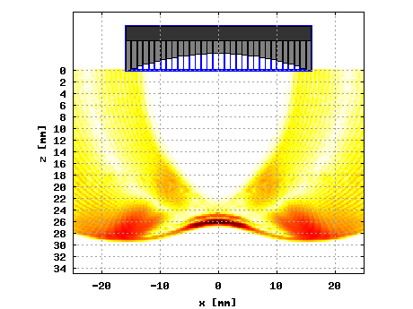

# Introduction

The DREAM (Discrete REpresentation Array Modeling) toolbox is a free open source toolbox
for simulating acoustic fields radiated from common ultrasonic transducer types and arbitrarily
complicated ultrasonic transducers arrays. The DREAM toolbox enables analysis of beam-steering,
beam-focusing, and apodization for wideband (pulse) excitation both in near and far fields.

The DREAM toolbox can be used to, for example, simulate and evaluate array designs, evaluate imaging
methods etc. An example is shown in Figure 1 below where the wavefield of an (undersampled)
32 element linear array has been simulated.

_Figure 1. Simulated wavefield snapshot for a 32 element linear array._

The toolbox consists of a set of routines for computing (discrete) spatial impulse responses (SIRs)
for various single-element transducer geometries as well as multi-element transducer arrays. Based on
linear systems theory, these SIR functions can then be convolved with the transducer's electrical impulse
response to obtain the acoustic field at an observation point. Using the DREAM toolbox one can simulate
ultrasonic measurement systems for many configurations including phased arrays and measurements performed
in lossy media.

The DREAM toolbox uses a numerical procedure based on based on the discrete representation (DR) computational
concept [[[1]](#1),[[2]](#2)] which is a method based on the general approach of the spatial impulse responses [[[3]](#3),[[4]](#4)].

The DREAM Toolbox can be used using:
* Matlab and Octave,
* Python (experimental).

## Features

* Computes spatial impulse responses (SIRs) directly in a discrete form,
* Support for many common transducer and array types,
* Support for parallel processing using threads,
* Compute SIRs for lossy media.

## References

<a id="1">[1]</a> B.Piwakowski and B. Delannoy. "Method for Computing Spatial Pulse Response: Time-domain Approach", Journal of the Acoustical
Society of America, vol. 86, no. 6, pp. 2422--32, Dec. 1989.

<a id="2">[2]</a> B. Piwakowski and K. Sbai. "A New Approach to Calculate the Field Radiated from Arbitrarily Structured Transducer Arrays",
IEEE Transactions on Ultrasonics, Ferroelectrics and Frequency Control, vol. 46, no. 2, pp. 422--40, March 1999.

<a id="3">[3]</a> G. E. Tupholme, "Generation of acoustic pulses by baffled plane pistons", Mathematika, vol 16, pp. 209--224, 1969.

<a id="4">[4]</a> P.R. Stepanishen. "Transient radiation from pistons in an infinite planar baffle", Journal of the Acoustical Society of America,
vol 49, pp. 1629--38, 1971.

# Installation

See the installation instructions [here](INSTALLATION.md).
